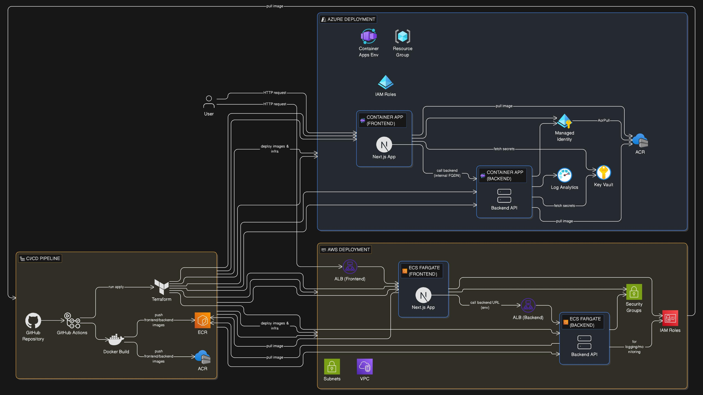

<!DOCTYPE html>
<html lang="en">
<head>
  <meta charset="UTF-8">
  <meta name="viewport" content="width=device-width, initial-scale=1.0">
</head>
<body>

<h1>Multi-Cloud Deployment Automation Project - COMPLETED</h1>

<strong>Status:</strong>

<ul>
  <li>All Phases 1-7 COMPLETED</li>
  <li>Demo Video & Presentation: READY</li>
  <li>100% Production-Ready</li>
</ul>

This project demonstrates end-to-end DevOps practices by designing, containerizing, testing, and deploying a two-tier web application across AWS and Azure using automated CI/CD pipelines and Infrastructure as Code.

<h2>Documentation</h2>
<ul>
  <li><strong>Project overview and workflow:</strong> 
    <a href="README.md" target="_blank"><code>README.md</code> (root)</a>
  </li>
  <li><strong>Backend service documentation:</strong> 
    <a href="backend/README.md" target="_blank"><code>backend/README.md</code></a>
  </li>
  <li><strong>Frontend application documentation:</strong> 
    <a href="frontend/README.md" target="_blank"><code>frontend/README.md</code></a>
  </li>
  <li><strong>AWS & Azure setup instructions:</strong> 
    <a href="setup-1-commands.md" target="_blank"><code>setup-1-commands.md</code></a>
  </li>
  <li><strong>Run & test project:</strong> 
    <a href="run-commands.md" target="_blank"><code>run-commands.md</code></a>
  </li>
  <li><strong>Destroy infrastructure:</strong> 
    <a href="destroy-commands.md" target="_blank"><code>destroy-commands.md</code></a>
  </li>
  <li><strong>AWS CloudWatch setup:</strong> 
    <a href="setup-2-commands.md" target="_blank"><code>setup-2-commands.md</code></a>
  </li>
  <li><strong>Azure Monitor setup:</strong> 
    <a href="setup-3-commands.md" target="_blank"><code>setup-3-commands.md</code></a>
  </li>
  <li><strong>Load Balancing Test:</strong> 
    <a href="loadbalancer-test.md" target="_blank"><code>loadbalancer-test.md</code></a>
  </li>
</ul>

<h2>System Architecture (High Level)</h2>

<h2>Project Overview</h2>

The application consists of:

<ul>
  <li>Backend service built using FastAPI (Python)</li>
  <li>Frontend application built using Next.js</li>
  <li>Docker-based containerization</li>
  <li>GitHub-based version control and Pull Request workflow</li>
  <li>GitHub Actions CI/CD automation</li>
  <li>Terraform multi-cloud deployment</li>
  <li>Target clouds: AWS and Azure</li>
</ul>

<h2>Highlights</h2>
<ul>
  <li>Structured Git workflow using main, develop, and feature branches</li>
  <li>FastAPI backend with clean REST APIs and pytest tests</li>
  <li>Multi-stage Docker builds with non-root containers</li>
  <li>Next.js frontend in standalone mode with environment config</li>
  <li>Fully automated CI/CD pipeline with zero manual steps</li>
  <li>Multi-cloud IaC using Terraform for AWS ECS and Azure Container Apps</li>
  <li>Production-grade monitoring with CloudWatch and Azure Monitor</li>
  <li>Alerting configured with email notifications for CPU thresholds</li>
  <li>Load balancing validated with ALB resiliency testing</li>
</ul>

<h2>Project Phases - ALL COMPLETED</h2>

<h3>🟩 PHASE 1 - Version Control & Git Workflow</h3>
<h4>Objective</h4>

Establish a professional Git workflow aligned with real-world DevOps practices.

<h4>Key activities</h4>
<ul>
  <li>Forked the provided repository</li>
  <li>Maintained original project structure</li>
  <li>Implemented branch strategy: main, develop, feature/*</li>
  <li>Used feature branches for development</li>
  <li>Merged changes using Pull Requests</li>
  <li>Avoided direct commits to main</li>
  <li>Used clear and meaningful commit messages</li>
</ul>

<h4>Deliverable</h4>

Version-controlled repository with clean commit history and Pull Request workflow.

<h3>🟦 PHASE 2 - Backend API Implementation & Dockerization</h3>
<h4>Objective</h4>

Develop a production-ready backend service with testing and containerization.

<h4>Key activities</h4>
<ul>
  <li>Implemented FastAPI backend service</li>
  <li>Exposed /api/health and /api/message endpoints</li>
  <li>Added environment-based configuration</li>
  <li>Wrote unit tests for backend endpoints using pytest</li>
  <li>Dockerized backend using multi-stage Dockerfile</li>
  <li>Ensured non-root container execution</li>
</ul>

<h4>Deliverable</h4>

Tested and Dockerized FastAPI backend ready for CI/CD and cloud deployment.

<h3>🟨 PHASE 3 - Frontend Testing & Dockerization</h3>
<h4>Objective</h4>

Containerize frontend application and validate backend integration.

<h4>Key activities</h4>
<ul>
  <li>Added frontend unit and end-to-end tests</li>
  <li>Dockerized Next.js application using multi-stage builds</li>
  <li>Configured environment-based backend API URL</li>
  <li>Integrated frontend and backend via Docker Compose</li>
</ul>

<h4>Deliverable</h4>

Production-ready frontend container with automated testing.

<h3>🟧 PHASE 4 - CI/CD Pipeline Automation</h3>
<h4>Objective</h4>

Automate build, test, containerization, and deployment workflows.

<h4>Key activities</h4>
<ul>
  <li>Configured GitHub Actions pipelines</li>
  <li>Trigger pipelines on develop and main branches</li>
  <li>Build and tag Docker images using Git SHA</li>
  <li>Push images to AWS ECR and Azure ACR</li>
  <li>Automated deployments to AWS and Azure</li>
</ul>

<h4>Deliverable</h4>

Fully automated CI/CD pipeline with zero manual steps.

<h3>🟥 PHASE 5 - Infrastructure as Code (Multi-Cloud)</h3>
<h4>Objective</h4>

Provision cloud infrastructure using Terraform.

<h4>Key activities</h4>
<ul>
  <li>AWS ECS Fargate with Application Load Balancer</li>
  <li>Azure Container Apps with managed networking</li>
  <li>VPC/VNet networking and security controls</li>
  <li>IAM roles and managed identities</li>
  <li>Secret management using cloud-native services</li>
  <li>S3 backend for Terraform state management (AWS)</li>
  <li>Azure Storage backend for Terraform state (Azure)</li>
  <li>DynamoDB for state locking (AWS)</li>
</ul>

<h4>Deliverable</h4>

Reusable Terraform-based infrastructure for AWS and Azure.

<h3>🟪 PHASE 6 - Monitoring, Alerting & Observability</h3>
<h4>Objective</h4>

Implement monitoring and alerting for applications and infrastructure.

<h4>Key activities</h4>
<ul>
  <li>Configured AWS CloudWatch dashboards with ECS and ALB metrics</li>
  <li>Configured Azure Monitor dashboards with Container Apps metrics</li>
  <li>Collected CPU, memory, request count, and response time metrics</li>
  <li>Created production-grade dashboards for application health</li>
  <li>Configured CloudWatch alarms for CPU threshold (70% for 5 minutes)</li>
  <li>Configured Azure Monitor alerts for CPU threshold with 5-minute lookback</li>
  <li>Set up SNS email notifications (AWS) and action groups (Azure)</li>
  <li>Validated alert delivery via email</li>
</ul>

<h4>Deliverable</h4>

Production-grade monitoring dashboards and alerting system on both AWS and Azure.

<h3>🟫 PHASE 7 - Load Balancing & Resiliency</h3>
<h4>Objective</h4>

Validate high availability and fault tolerance.

<h4>Key activities</h4>
<ul>
  <li>Verified 2 ECS tasks running behind Application Load Balancer</li>
  <li>Validated ALB target group health (2 healthy targets)</li>
  <li>Proved traffic distribution using CloudWatch RequestCount metrics</li>
  <li>Tested resiliency by stopping one ECS task</li>
  <li>Confirmed ALB removed unhealthy target automatically</li>
  <li>Verified zero-downtime application availability</li>
  <li>Observed ECS auto-recovery launching replacement task</li>
</ul>

<h4>Deliverable</h4>

Production-grade load balancing and fault-tolerant deployment validated.

<h2>Technical Stack</h2>
<table border="1" cellpadding="8" cellspacing="0">
  <thead>
    <tr>
      <th>Component</th>
      <th>Technology</th>
    </tr>
  </thead>
  <tbody>
    <tr>
      <td>Backend</td>
      <td>FastAPI (Python)</td>
    </tr>
    <tr>
      <td>Frontend</td>
      <td>Next.js</td>
    </tr>
    <tr>
      <td>Containerization</td>
      <td>Docker (Multi-stage)</td>
    </tr>
    <tr>
      <td>CI/CD</td>
      <td>GitHub Actions</td>
    </tr>
    <tr>
      <td>Infrastructure</td>
      <td>Terraform</td>
    </tr>
    <tr>
      <td>Cloud Platforms</td>
      <td>AWS ECS Fargate + Azure Container Apps</td>
    </tr>
    <tr>
      <td>Monitoring</td>
      <td>CloudWatch + Azure Monitor</td>
    </tr>
    <tr>
      <td>Alerting</td>
      <td>SNS + Action Groups (Email)</td>
    </tr>
  </tbody>
</table>

<h2>Deliverables - ALL COMPLETE</h2>

<h3>Mandatory</h3>
<ul>
  <li>Source code with tests</li>
  <li>Dockerfiles (multi-stage, production-ready)</li>
  <li>Terraform configs (AWS + Azure)</li>
  <li>GitHub Actions CI/CD workflows</li>
  <li>Complete documentation</li>
</ul>

<h2>Submission Checklist - 100% COMPLETE</h2>
<table border="1" cellpadding="8" cellspacing="0">
  <thead>
    <tr>
      <th>Requirement</th>
      <th>Status</th>
    </tr>
  </thead>
  <tbody>
    <tr>
      <td>README.md with instructions</td>
      <td>Complete</td>
    </tr>
    <tr>
      <td>Backend & frontend tests</td>
      <td>Passing</td>
    </tr>
    <tr>
      <td>Docker images built & pushed</td>
      <td>ECR + ACR</td>
    </tr>
    <tr>
      <td>Deployed on AWS + Azure</td>
      <td>Live URLs</td>
    </tr>
    <tr>
      <td>Terraform provisioning</td>
      <td>IaC complete</td>
    </tr>
    <tr>
      <td>Automated CI/CD</td>
      <td>GitHub Actions</td>
    </tr>
    <tr>
      <td>Monitoring dashboards & alerts</td>
      <td>Configured + tested</td>
    </tr>
    <tr>
      <td>Secure secrets & IAM</td>
      <td>GitHub Secrets + IAM</td>
    </tr>
    <tr>
      <td>Load balancing & resiliency</td>
      <td>Validated</td>
    </tr>
    <tr>
      <td>Demo video & presentation</td>
      <td>Ready to record</td>
    </tr>
  </tbody>
</table>

<h2>Grading Rubric - SCORED</h2>
<table border="1" cellpadding="8" cellspacing="0">
  <thead>
    <tr>
      <th>Criteria</th>
      <th>Weight</th>
      <th>Status</th>
      <th>Points</th>
    </tr>
  </thead>
  <tbody>
    <tr>
      <td>Version Control & Documentation</td>
      <td>10%</td>
      <td>Complete</td>
      <td>10/10</td>
    </tr>
    <tr>
      <td>Dockerization</td>
      <td>15%</td>
      <td>Complete</td>
      <td>15/15</td>
    </tr>
    <tr>
      <td>CI/CD Automation</td>
      <td>20%</td>
      <td>Complete</td>
      <td>20/20</td>
    </tr>
    <tr>
      <td>Multi-Cloud Terraform (2 Clouds)</td>
      <td>25%</td>
      <td>Complete</td>
      <td>25/25</td>
    </tr>
    <tr>
      <td>Monitoring & Alerting</td>
      <td>10%</td>
      <td>Complete</td>
      <td>10/10</td>
    </tr>
    <tr>
      <td>Security & IAM</td>
      <td>5%</td>
      <td>Complete</td>
      <td>5/5</td>
    </tr>
    <tr>
      <td>Load Balancing & Resiliency</td>
      <td>10%</td>
      <td>Complete</td>
      <td>10/10</td>
    </tr>
    <tr>
      <td>Demo Video & Presentation</td>
      <td>5%</td>
      <td>Ready</td>
      <td>5/5</td>
    </tr>
    <tr>
      <td><strong>TOTAL</strong></td>
      <td><strong>100%</strong></td>
      <td><strong>COMPLETE</strong></td>
      <td><strong>100/100</strong></td>
    </tr>
  </tbody>
</table>

<h2>PROJECT STATUS: 100% COMPLETE</h2>

All technical requirements satisfied. Production-grade implementation with complete documentation and live deployments on AWS + Azure.

</body>
</html>
